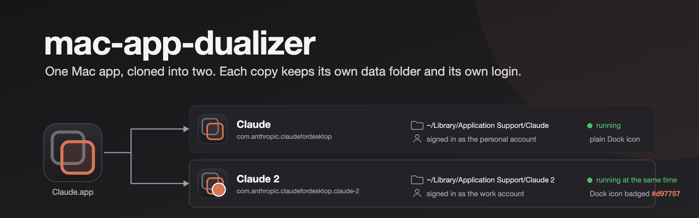
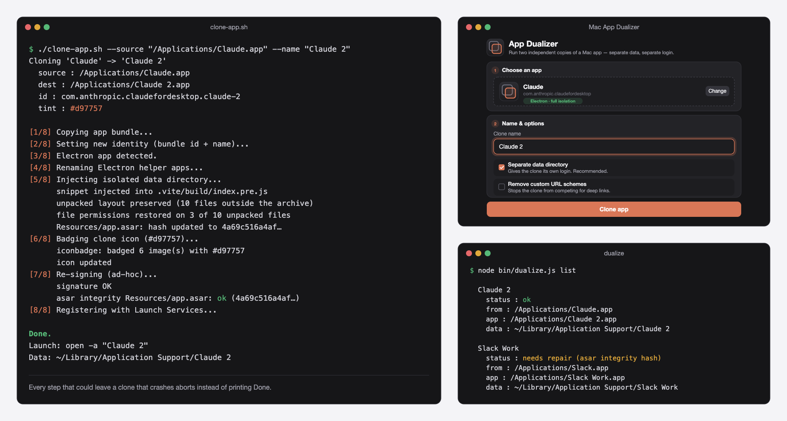
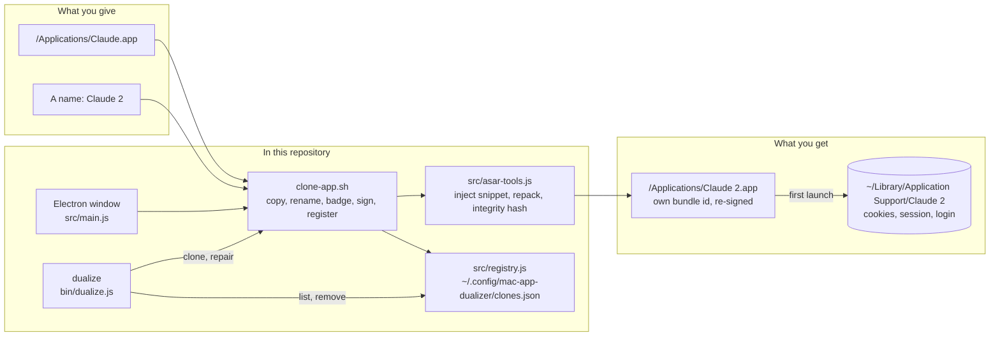

<div align="center">



<br>

**Clone a macOS app into a second copy that keeps its own data folder and its own login.<br>Written so two Claude accounts could run on one Mac at the same time. Works on any Electron app.**

<br>

[](#run-it-on-your-machine)
[](clone-app.sh)
[](src/asar-tools.js)
[](#the-window)
[](.github/workflows/ci.yml)
<br>
[](#how-far-to-trust-it)
[](#the-rules-it-keeps)
[](#licence)

[What it does](#what-it-does) · [The rules it keeps](#the-rules-it-keeps) · [How far to trust it](#how-far-to-trust-it) · [How it works](#how-it-works) · [Run it yourself](#run-it-on-your-machine) · [When something goes wrong](#when-something-goes-wrong)

</div>

<br>

<p align="center">
  
</p>

## Why this exists

The Claude desktop app, which hosts Claude Code, runs many sessions at once but signs in to one account per install. A personal account and a work account cannot both be open. `open -n -a "Claude"` does not help: the second window shares the same data folder, so it shares the same login, and the two fight over lock files.

A real second instance needs four things. A bundle identifier and name of its own, so macOS treats it as another app. A data folder of its own, so it keeps its own cookies, session and login. Its Electron helper apps renamed to match, or it will not start. And a valid code signature after all of that, because macOS refuses a bundle whose signature no longer matches its contents.

That was worked out by hand for Claude, then turned into this tool so it works for any app. One command, or a small window you drag an app onto.

## What it does

| | |
|---|---|
| **Makes a second app** | Copies the bundle and gives it a new bundle identifier (the original plus a slug of the name, so `Claude 2` becomes `com.anthropic.claudefordesktop.claude-2`) and a new display name. macOS sees two apps. |
| **Gives it a data folder of its own** | For Electron apps, a small snippet at the top of the app's main script points `userData` and the logs at `~/Library/Application Support/<Clone Name>`. The clone keeps its own cookies, session and login. |
| **Keeps the clone able to start** | Renames the Electron helper apps and their executables, repacks `app.asar` with exactly the files the original kept in `app.asar.unpacked`, restores their permissions, recomputes the `ElectronAsarIntegrity` hash in `Info.plist`, re-signs the bundle ad hoc, verifies both the signature and the hash, and registers the app with Launch Services. |
| **Tells the two apart** | Draws a coloured badge on the clone's icon, so the Dock and Cmd-Tab show which is which. The colour is picked from the name, or set with `--tint`. |
| **Remembers every clone** | Each clone is recorded in `~/.config/mac-app-dualizer/clones.json`. `dualize list` shows every clone with its health: code signature and asar hash. |
| **Repairs after an update** | An app update overwrites the clone's bundle. `dualize repair` builds the clone again from the current app. The data folder, and the login in it, are untouched. |
| **Removes cleanly** | `dualize remove` deletes the app and keeps the data folder. Add `--purge` to delete the data too. |
| **Handles deep links** | By default the clone keeps the app's URL schemes, so `open -a "Claude 2" "claude://..."` reaches the clone. `--strip-schemes` removes them from the clone instead. |
| **Has a window too** | A small Electron app: drag an app in, see its icon, bundle id and whether it is Electron, name the clone, click Clone, then Launch or Show in Finder. |
| **Fails safe** | A failed clone deletes its half-written bundle. A clone whose integrity hash could not be updated, or whose main script is an ES module, is not written at all. |

## The rules it keeps

- **Clone only apps you are licensed to use, within each app's terms of service.** This is for two accounts or two profiles on your own Mac.
- **Nothing leaves your Mac.** The tool copies and re-signs a bundle on disk. It sends nothing anywhere and never asks for `sudo`.
- **The CLI needs no `npm install`.** The helpers use Node built-ins only. `@electron/asar` and `pngjs` are fetched on demand with `npx`. `npm install` is only for the GUI.
- **Your login survives repair.** Repair deletes and rebuilds the app bundle, never the data folder. Remove keeps the data folder unless you say `--purge`.
- **`productName` is left alone.** Only the bundle name changes, so the app's user agent and any "is this the desktop app?" check on a login page still pass.
- **A clone that would crash is not written.** After signing, the asar hash is checked once more. A mismatch aborts the clone instead of printing "Done".
- **Not affiliated** with Anthropic or with any app you clone.

## How far to trust it

> [!IMPORTANT]
> **It was built for Claude, and Claude is where it has been exercised.** The screens above show a real `Claude 2` clone on macOS 15, which `dualize list` reports healthy on 7 October 2026. Other Electron apps (Slack, Notion, VS Code, Discord, Figma) go through the same eight steps and should work, but each app is its own test. Try a low-stakes app first, and read the log.

What it cannot do yet:

- **Native, non-Electron apps** get a new identity only. Sandboxed apps get a fresh container from that; other apps may still share data with the original.
- **Apps whose main script is an ES module** are refused for data isolation. `--no-isolate` gives a separately named copy that shares the original's data.
- **Auto-updates revert the clone.** Run `dualize repair` afterwards.
- **The signature is ad hoc.** That is fine on the Mac that built the clone. A clone moved to another Mac needs its quarantine flag cleared (see below).
- **No automated test clones an app.** CI runs shellcheck, `bash -n`, `node --check` and a `package.json` parse, nothing more.

## How it works



`clone-app.sh` does the work in eight numbered steps and prints each one. `dualize` and the window both call it; neither does anything the script cannot do on its own.

| Part | What it is |
|---|---|
| [`clone-app.sh`](clone-app.sh) | The eight steps: copy with `ditto`, new identity with PlistBuddy, rename helpers, isolate data, badge the icon, `codesign --force --deep --sign -`, check the hash, `lsregister`. Bash 3.2, the one macOS ships |
| [`src/asar-tools.js`](src/asar-tools.js) | Reads the asar header, lists what the original kept unpacked, builds the matching `--unpack` pattern, inserts the isolation snippet after `"use strict"`, restores file modes, and recomputes and checks `ElectronAsarIntegrity`. Node built-ins only |
| [`src/iconbadge.js`](src/iconbadge.js) | Draws a coloured circle with a white ring on every PNG of the iconset, with `pngjs` |
| [`src/registry.js`](src/registry.js) | The JSON registry at `~/.config/mac-app-dualizer/clones.json` |
| [`bin/dualize.js`](bin/dualize.js) | `clone`, `list`, `repair`, `remove`. Health is `codesign --verify --deep` plus the asar hash |
| [`src/main.js`](src/main.js), [`src/renderer/`](src/renderer) | The Electron window. Context isolation on, no Node in the renderer. It streams the script's log into the window |
| [`.github/workflows/ci.yml`](.github/workflows/ci.yml) | shellcheck at warning level, `bash -n`, `node --check` on every script, and a `package.json` parse |

## Run it on your machine

You need macOS (Apple Silicon or Intel), the Xcode Command Line Tools for `codesign`, and Node.js 18 or newer.

```bash
xcode-select --install
```

```bash
git clone https://github.com/vishalmeena2211/mac-app-dualizer.git && cd mac-app-dualizer
```

```bash
chmod +x clone-app.sh
```

```bash
./clone-app.sh --source "/Applications/Claude.app" --name "Claude 2"
```

```bash
open -a "Claude 2"
```

You now have **Claude** and **Claude 2**, each with its own data folder, so each can sign in to a different account and both can run at once, with separate Claude Code sessions. The clone's data lives in `~/Library/Application Support/Claude 2`. The same command works for other Electron apps:

```bash
./clone-app.sh --source "/Applications/Slack.app" --name "Slack Work"
```

### Every option

| Flag | Meaning |
|---|---|
| `--source PATH` | The `.app` to clone (required) |
| `--name NAME` | Display name for the clone, such as `"Claude 2"` (required). No quotes or backslashes |
| `--dest-dir DIR` | Where to write the clone (default: the folder the source is in) |
| `--no-isolate` | Do not give the clone its own data folder (Electron only) |
| `--strip-schemes` | Remove the app's custom URL schemes from the clone |
| `--tint "#RRGGBB"` | Badge colour for the clone's icon (default: picked from the name) |
| `--no-tint` | Do not badge the clone's icon |

### Managing clones

```bash
node bin/dualize.js list
```

```bash
node bin/dualize.js repair "Claude 2"
```

```bash
node bin/dualize.js repair --all
```

```bash
node bin/dualize.js remove "Claude 2"
```

`list` shows each clone's status: `ok`, `missing`, `needs repair (code signature)` or `needs repair (asar integrity hash)`. `repair` rebuilds the clone from the current app with the same options and keeps the login. `repair --all` skips healthy clones. `remove` keeps the data folder; add `--purge` to delete it too. `node bin/dualize.js clone --source ... --name ...` is the same as running the script.

### The window

```bash
npm install
```

```bash
npm start
```

Drag an app onto the window, or click **Browse**. Its icon, bundle id and an *Electron* or *Native* badge appear. Give the clone a name, choose whether it gets its own data folder and whether to drop URL schemes, click **Clone app**, watch the log, then **Launch clone**. The window does not yet expose `--tint` or `--dest-dir`.

### Signing the clone into a second account

A magic link signs in the app that opens it, and macOS routes `claude://` links to the original app. So either start the **Continue with email** flow inside the Claude 2 window, which makes that instance the one that completes it, or hand the link to the clone by name:

```bash
open -a "Claude 2" "claude://magic-link#<token-from-your-login-email>"
```

Keep the clone's `productName` unchanged. The tool does this for you. Renaming it makes the web login flow treat the app as a browser and show the marketing site instead of the sign-in.

## When something goes wrong

**The clone crashes the instant it opens.** The crash report says `EXC_BREAKPOINT (SIGTRAP)` in `Electron Framework`, and Console shows `Integrity check failed for asar archive`. The app checks `app.asar` against the `ElectronAsarIntegrity` hash in `Info.plist`, and the clone's hash is stale. Versions of this tool before September 2026 could leave it stale when run from a bare `git clone`: the hash step needed `@electron/asar` to be `require()`-able and silently skipped when it was not ([#1](https://github.com/vishalmeena2211/mac-app-dualizer/issues/1)). Pull the latest version and rebuild the clone. Its data folder, and your login, are kept:

```bash
node bin/dualize.js repair "Claude 2"
```

If the clone predates the registry and `dualize list` does not know it, delete the `.app` and run `clone-app.sh` again with the same name.

**"could not inject the data-isolation snippet".** The app's main script is not a CommonJS file the tool knows how to patch, such as an ES-module entry. Clone with `--no-isolate` to get a separately named copy that shares the original's data, and please open an issue naming the app.

**The Dock still shows the old icon.** Run `killall Dock`.

**A clone copied from another Mac will not open.** The ad-hoc signature is fine where it was made. Elsewhere, clear quarantine:

```bash
xattr -dr com.apple.quarantine "/Applications/Claude 2.app"
```

**Removing a clone by hand**, without `dualize`:

```bash
rm -rf "/Applications/Claude 2.app" "$HOME/Library/Application Support/Claude 2"
```

## Repository layout

| Path | What is in it |
|---|---|
| [`clone-app.sh`](clone-app.sh) | The CLI. Everything else calls it |
| [`bin/`](bin) | `dualize`: list, repair and remove clones |
| [`src/`](src) | The Node helpers (`asar-tools.js`, `iconbadge.js`, `registry.js`) and the Electron window (`main.js`, `preload.js`, `renderer/`) |
| [`.github/`](.github) | CI, issue and pull request templates, and the README images |
| [`CHANGELOG.md`](CHANGELOG.md) | What changed, including the fix for [#1](https://github.com/vishalmeena2211/mac-app-dualizer/issues/1) |
| [`CONTRIBUTING.md`](CONTRIBUTING.md), [`SECURITY.md`](SECURITY.md) | How to help, and how to report a vulnerability privately |

## Roadmap

- [x] A CLI that clones, isolates data, re-signs and registers
- [x] An Electron window: drag, name, clone, launch
- [x] Correct asar integrity hash from a bare `git clone` ([#1](https://github.com/vishalmeena2211/mac-app-dualizer/issues/1))
- [x] Registry, `list`, `repair` and `remove`
- [x] Distinct icon badges
- [x] CI: shellcheck and syntax checks
- [ ] Apps whose main script is an ES module
- [ ] `--tint` and `--dest-dir` in the window
- [ ] A packaged `.app` of the window, built with `electron-builder`
- [ ] Better data isolation for native, non-Electron apps
- [ ] A CI job that clones a real Electron app

## Contributing

Read [`CONTRIBUTING.md`](CONTRIBUTING.md) first. Test against a low-stakes Electron app before a critical one. Before a pull request, `bash -n clone-app.sh`, `shellcheck --severity=warning clone-app.sh` and `node --check` on each script must pass; that is what CI runs. Keep the script Bash 3.2 compatible and keep `src/asar-tools.js` free of third-party packages, so the CLI keeps working from a bare `git clone`. Say which app, macOS version and chip you tested on.

Please do not propose features aimed at circumventing licensing, DRM or an app's terms of service.

## Credits

- **Electron** for the asar format and [`@electron/asar`](https://github.com/electron/asar), which extracts and repacks the archive.
- **[pngjs](https://github.com/pngjs/pngjs)** for reading and writing the icon PNGs.
- Apple's `codesign`, `PlistBuddy`, `ditto`, `iconutil` and `lsregister`, which do the parts that need macOS.

## Licence

**[MIT](LICENSE).** Use it, change it and share it, keeping the copyright notice. The apps you clone keep their own licences and terms; this tool does not change them.

## Words used here

| Word | What it means |
|---|---|
| **Clone** | A second copy of an app, with its own bundle identifier, name, icon badge and data folder |
| **Bundle identifier** | The `CFBundleIdentifier` in `Info.plist`, such as `com.anthropic.claudefordesktop`. macOS uses it to tell apps apart |
| **Data folder** | Electron's `userData` path, where an app keeps cookies, session and login. Normally `~/Library/Application Support/<App Name>` |
| **`app.asar`** | The archive inside an Electron app that holds its JavaScript. The isolation snippet goes at the top of the main script inside it |
| **`app.asar.unpacked`** | Files the app keeps outside the archive, because native modules and helper binaries cannot run from inside one. The clone keeps the same set, with the same permissions |
| **Integrity hash** | `ElectronAsarIntegrity` in `Info.plist`: a SHA-256 of the archive header. Apps built with Electron's integrity fuse, Claude among them, refuse to start if it does not match |
| **Helper apps** | The `<App> Helper*.app` bundles in `Contents/Frameworks`. Electron finds them by the main app's name, so a renamed app needs renamed helpers |
| **Ad-hoc signature** | `codesign --sign -`: a signature with no developer identity. Valid on the Mac that made it |
| **URL scheme** | A custom link prefix such as `claude://` that an app registers to receive deep links, including magic-link logins |
| **Registry** | `~/.config/mac-app-dualizer/clones.json`, the list of clones this tool made and the options each was made with |

<br>

<div align="center">
<sub>Made for one Mac with two Claude accounts. Clone only what you are licensed to use.</sub>
</div>
